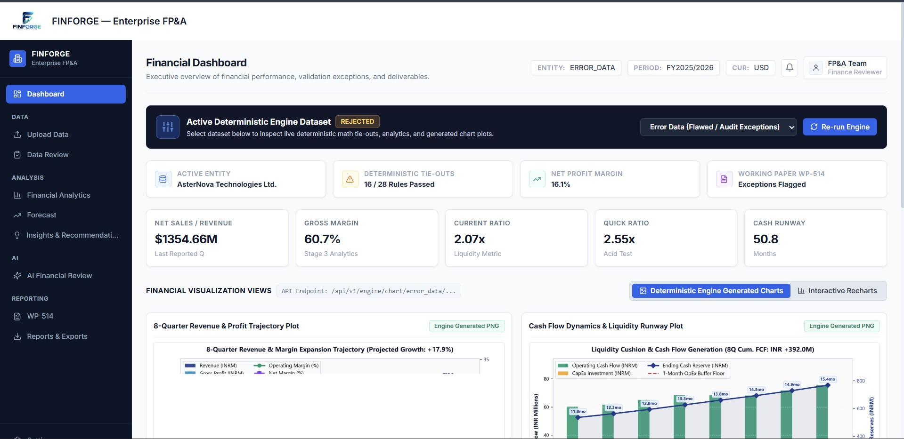
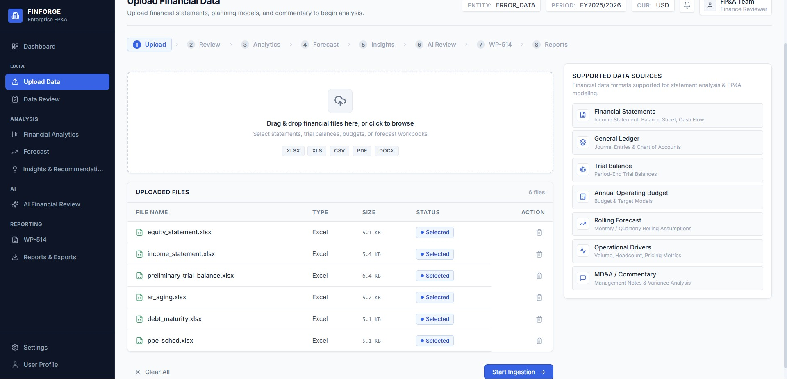
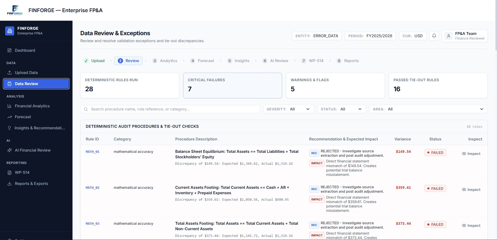
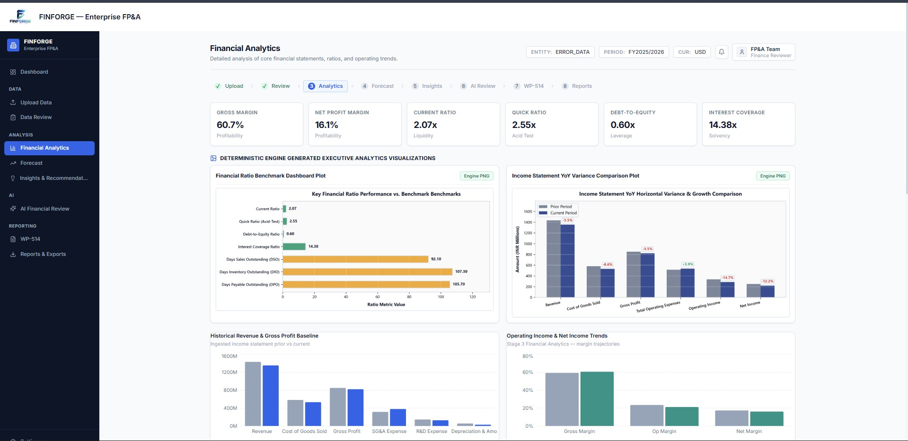
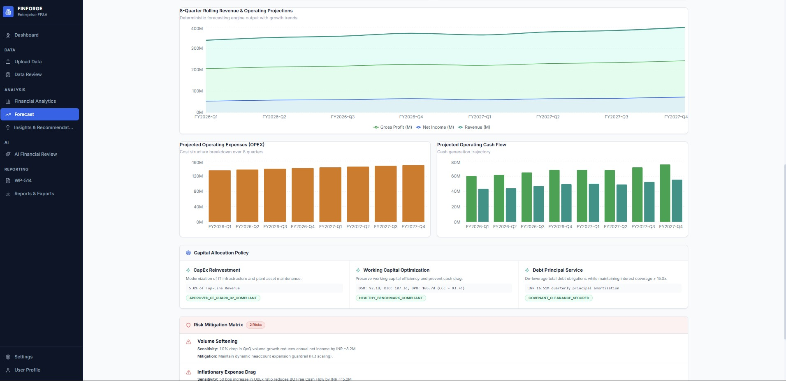
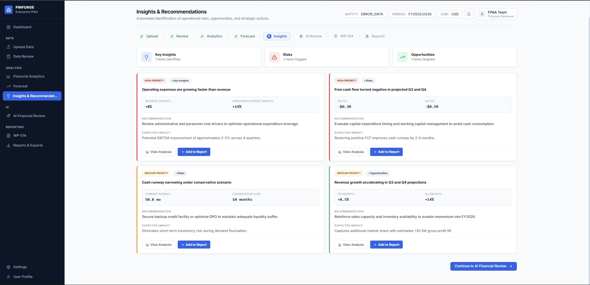
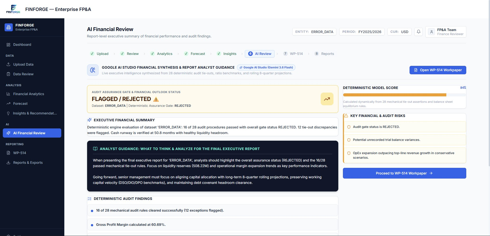
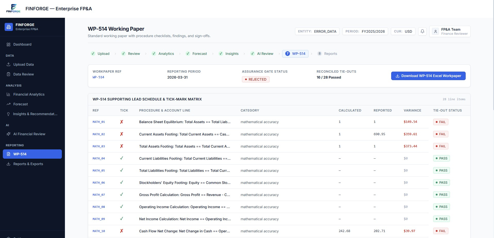
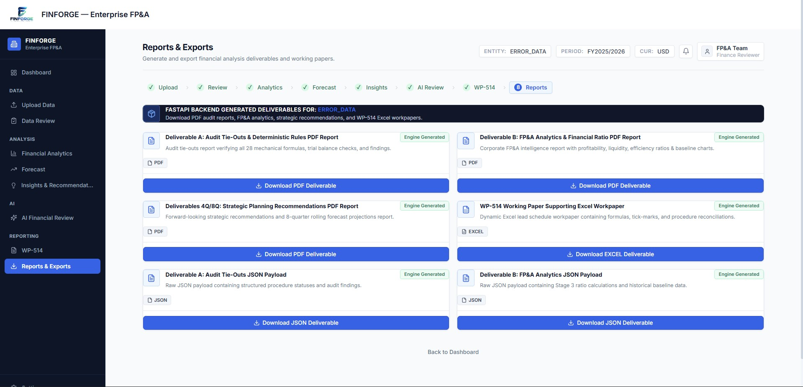
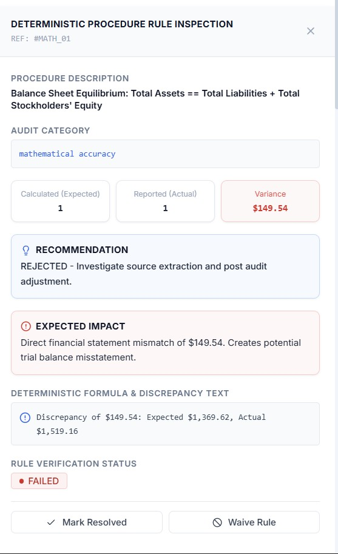

# FinForge

FinForge is an enterprise-grade financial intelligence platform that ingests financial datasets, validates them through deterministic audit logic, generates FP&A analytics and forecasts, and presents outputs through a modern React-based dashboard. The solution combines a production-style FastAPI backend, a deterministic Python analytics engine, and a user-centric frontend experience to streamline financial review, audit exception analysis, and strategic planning.

## Executive Summary

FinForge is designed for teams working with financial statements, planning data, lead schedules, and reconciliation packs. It transforms raw uploaded files into a controlled, traceable analytics workflow:

- File ingestion and dataset normalization
- Audit rule execution and exception detection
- Financial analytics and ratio intelligence
- Rolling forecast generation and strategic recommendation outputs
- PDF/Excel/JSON deliverable export
- Executive AI summary generation using Gemini-style model integration
- Frontend dashboard for review, navigation, and operational monitoring

The platform is intentionally structured around a clear separation of concerns:

- Frontend: React + Vite + TypeScript + Tailwind CSS
- Backend API: FastAPI
- Deterministic Engine: Python-based audit, analytics, and forecasting engine
- Storage/Metadata Layer: Supabase
- Output Delivery: JSON, PDF, PNG charts, Excel workpapers

## Business Value

FinForge helps finance, audit, and FP&A teams to:

- reduce manual validation effort
- improve tie-out quality and exception transparency
- automate financial analytics trends and ratio monitoring
- generate 4Q/8Q projections and strategic planning insights
- standardize evidence and reporting through auditable outputs
- accelerate review cycles across finance and leadership stakeholders

## Architecture Overview

The system has a three-tier architecture:

1. Presentation Layer (Frontend)
   - React + TypeScript application
   - modular page-based dashboard
   - KPI cards, charts, filters, workflow indicators, and report exports

2. Application Layer (Backend API)
   - FastAPI service exposes ingestion and engine endpoints
   - handles uploads, validation, orchestration, and report retrieval
   - serves generated charts and downloadable reports

3. Intelligence Layer (Deterministic Engine)
   - Python engine loads dataset folders and executes finance logic
   - creates structured audit reports, analytics, scenario projections, and charts
   - generates PDF and Excel deliverables for audit and planning outputs

High-level flow:

```text
Upload / Ingest Data
        |
        v
Frontend (React Dashboard)
        |
        v
FastAPI Backend
        |
        +--> Store metadata / deliverables in Supabase
        |
        v
Deterministic Engine
        |
        +--> Audit Tie-Outs
        +--> FP&A Analytics
        +--> 4Q / 8Q Forecasts
        +--> Strategic Recommendations
        +--> PNG / PDF / Excel Outputs
        |
        v
Frontend visualization + report downloads
```

## Product Screenshots & Architecture Views

<table border="1" cellpadding="12" cellspacing="0" style="border-collapse:collapse; width:100%; border:1px solid #d0d7de; border-radius:8px;">
  <tr>
    <td align="center" valign="top" style="border:1px solid #d0d7de; padding:12px;">
      <br>
      <strong>Dashboard</strong>
    </td>
    <td align="center" valign="top" style="border:1px solid #d0d7de; padding:12px;">
      <br>
      <strong>Upload Data</strong>
    </td>
  </tr>
  <tr>
    <td align="center" valign="top" style="border:1px solid #d0d7de; padding:12px;">
      <br>
      <strong>Data Review & Exceptions</strong>
    </td>
    <td align="center" valign="top" style="border:1px solid #d0d7de; padding:12px;">
      <br>
      <strong>Financial Analytics</strong>
    </td>
  </tr>
  <tr>
    <td align="center" valign="top" style="border:1px solid #d0d7de; padding:12px;">
      <br>
      <strong>Forecast & Scenario Planning</strong>
    </td>
    <td align="center" valign="top" style="border:1px solid #d0d7de; padding:12px;">
      <br>
      <strong>Insights & Recommendations</strong>
    </td>
  </tr>
  <tr>
    <td align="center" valign="top" style="border:1px solid #d0d7de; padding:12px;">
      <br>
      <strong>AI Financial Review</strong>
    </td>
    <td align="center" valign="top" style="border:1px solid #d0d7de; padding:12px;">
      <br>
      <strong>WP-514 Working Paper</strong>
    </td>
  </tr>
  <tr>
    <td align="center" valign="top" style="border:1px solid #d0d7de; padding:12px;">
      <br>
      <strong>Reports & Exports</strong>
    </td>
    <td align="center" valign="top" style="border:1px solid #d0d7de; padding:12px;">
      <br>
      <strong>Deterministic Rule Inspection</strong>
    </td>
  </tr>
</table>

## Repository Structure

```text
FinForge/
├── Backend/
│   └── app/
│       ├── __init__.py
│       ├── database.py
│       ├── main.py
│       ├── routes/
│       │   ├── engine.py
│       │   └── ingestion.py
│       └── services/
│           ├── ai_service.py
│           ├── engine_service.py
│           ├── ingestion.py
│           ├── metadata.py
│           └── parser.py
├── Frontend/
│   ├── src/
│   ├── package.json
│   ├── vite.config.ts
│   ├── tailwind.config.js
│   └── README.md
├── deterministic_engine/
│   ├── analytics/
│   ├── data_generator/
│   ├── forecasting/
│   ├── math_engine/
│   ├── reporters/
│   ├── schema/
│   ├── result/
│   ├── Data/
│   ├── main.py
│   └── tests/
├── .gitignore
├── README.md
└── .vscode/
```

## Technology Stack

### Frontend

- React 18
- TypeScript
- Vite
- Tailwind CSS
- Recharts for visualization
- Lucide-react for UI icons
- Centralized API service layer for backend integration

### Backend

- FastAPI
- Python 3.x
- Uvicorn
- CORS-enabled API layer
- File upload handling and validation
- Structured JSON response design

### Deterministic Engine

- Python engine for validation and reporting
- Excel/CSV/JSON ingestion
- schema-driven data model validation
- mathematical control and tie-out logic
- financial analytics and scenario forecasting
- chart generation and PDF report output

### Data & Integration

- Supabase for metadata/report persistence
- environment-driven configuration
- support for structured storage of engine outputs
- optional Gemini-style AI summary generation

## Core Module Breakdown

### 1) Frontend Module

The frontend is a finance-operations dashboard that includes pages for:

- Dashboard
- Upload Financial Data
- Data Ingestion Pipeline
- Data Review & Exceptions
- Financial Analytics
- Forecast & Scenario Planning
- Insights & Recommendations
- AI Financial Review
- WP-514 Working Paper
- Reports & Exports

The app provides a navigation shell, KPI cards, filter bars, chart sections, and report actions. It is designed to present audit and planning outputs in a clean executive-friendly layout.

### 2) Backend API Module

The backend exposes a versioned API under `/api/v1` with two major domains:

- `/api/v1/ingestion`
- `/api/v1/engine`

It handles:

- uploaded file validation
- file parsing and ingestion orchestration
- dataset listing
- job execution triggers
- report retrieval and export
- chart serving

### 3) Deterministic Engine Module

This module is the analytical heart of the platform. It reads dataset directories, validates schemas, applies deterministic financial checks, and produces structured outputs.

It generates deliverables such as:

- Audit Tie-Outs report
- FP&A Analytics report
- Forecasting outputs for 4Q and 8Q scenarios
- strategic recommendations JSON
- chart images
- Excel workpaper outputs
- PDF exports

## API Routes

### Base Health Routes

#### GET `/`
Returns service metadata for the backend service.

Example response:

```json
{
  "service": "FinForge Backend",
  "status": "running"
}
```

#### GET `/health`
Returns backend health metadata.

Example response:

```json
{
  "status": "ok",
  "service": "finforge-backend"
}
```

### Ingestion Routes

#### POST `/api/v1/ingestion/upload`
Uploads a single file and stores it for processing.

Request:
- multipart form
- file: uploaded document
- period_type: current | prior | other
- dataset_id: logical dataset name
- source_path: optional source reference

Supported file types:
- .xlsx
- .xls
- .csv
- .json

Example response:

```json
{
  "success": true,
  "data": {
    "dataset_id": "default",
    "filename": "financial_data.xlsx",
    "status": "ingested"
  }
}
```

#### POST `/api/v1/ingestion/upload-batch`
Uploads multiple files in one batch request.

Request:
- multipart form
- files: list of uploaded files
- period_type: current | prior | other
- dataset_id: logical dataset key

Response returns processed and failed file results.

### Engine Routes

#### GET `/api/v1/engine/datasets`
Lists available financial datasets for analysis.

Response example:

```json
{
  "success": true,
  "count": 2,
  "datasets": [
    {
      "id": "error_data",
      "name": "Error Data (Flawed / Audit Exceptions)",
      "description": "Financial dataset containing intentional tie-out errors, mathematical discrepancies, and high audit risk.",
      "is_default": true
    },
    {
      "id": "true_data",
      "name": "True Data (Clean / Cleared Tie-outs)",
      "description": "Financial dataset with zero mathematical errors, fully reconciled lead schedules, and clean audit opinion.",
      "is_default": false
    }
  ]
}
```

#### POST `/api/v1/engine/run`
Runs the deterministic engine for a specified dataset.

Request body:

```json
{
  "dataset_id": "error_data",
  "remediated": false
}
```

Response:

```json
{
  "success": true,
  "data": {
    "status": "success",
    "message": "Deterministic engine executed successfully for 'error_data'.",
    "dataset_id": "error_data",
    "target_dir": ".../deterministic_engine/result/error_data",
    "overall_status": "FAIL"
  }
}
```

#### GET `/api/v1/engine/audit-report/{dataset_id}`
Returns the deterministic audit tie-out report JSON.

#### GET `/api/v1/engine/analytics/{dataset_id}`
Returns the FP&A analytics report JSON with financial ratios, variance analysis, and operational diagnostics.

#### GET `/api/v1/engine/forecast/{dataset_id}`
Returns rolling projection and strategic planning recommendations payloads.

#### GET `/api/v1/engine/wp514/{dataset_id}`
Returns WP-514 working paper data, schedule checks, procedure tie-outs, and conclusions.

#### GET `/api/v1/engine/ai-summary/{dataset_id}`
Generates an executive AI summary from the dataset using the AI service layer.

#### GET `/api/v1/engine/download/{dataset_id}/{file_type}`
Downloads generated deliverables.

Available file types include:
- audit_pdf
- fpa_pdf
- strategic_pdf
- wp514_excel

#### GET `/api/v1/engine/chart/{dataset_id}/{chart_name}`
Returns generated chart images.

Supported chart names include:
- ratios
- income_statement
- revenue_trajectory
- cash_runway

## Data Flow

The platform flow is intentionally deterministic and auditable:

1. User uploads source files through the frontend or API
2. backend validates the file and stores it into the ingestion pipeline
3. engine resolves dataset source and result directories
4. deterministic rules calculate financial exceptions and variances
5. analytics engine calculates trend metrics and ratio intelligence
6. forecast engine runs 4Q and 8Q projection logic
7. results are persisted locally and optionally in Supabase
8. frontend queries the backend to render dashboards and reports
9. users can export PDFs, charts, and Excel workpapers

## Frontend User Experience

The frontend is a role-centric finance review experience. It provides:

- single-page dashboard navigation
- dynamic dataset switching
- upload, validation, and ingestion review pages
- KPI-driven financial summary views
- analytics drill-down for statements and ratio analysis
- forecast recommendations
- AI-generated executive summaries
- evidence and export modules

Navigation includes sections such as:

- Dashboard
- Upload Data
- Ingestion
- Data Review
- Analytics
- Forecast
- Insights
- AI Review
- WP-514
- Reports

## Output & Deliverables

FinForge produces a complete financial review package designed for internal and stakeholder usage. The generated outputs include:

- Audit tie-outs PDF
- FP&A analytics PDF
- Strategic planning recommendations PDF
- WP-514 workpaper Excel outputs
- financial charts in PNG format
- JSON structured data for downstream systems

## Setup and Local Development

### Prerequisites

- Node.js 18+
- Python 3.10+
- npm
- pip
- environment variables configured for Supabase and optional AI services

### Frontend Setup

```bash
cd Frontend
npm install
npm run dev
```

Frontend runs by default through Vite on the local development port (commonly 5173).

### Backend Setup

```bash
cd Backend
pip install -r requirements.txt
```

If no requirements file is present in the repository package, install the required dependencies manually, including:

- fastapi
- uvicorn
- supabase
- python-dotenv
- openpyxl
- pandas
- matplotlib
- reportlab
- other packages required by the deterministic engine

Then start the API:

```bash
python -m uvicorn app.main:app --host 0.0.0.0 --port 8000 --reload
```

### Environment Variables

Set the following in a `.env` file or equivalent environment config:

```env
SUPABASE_URL=your_supabase_project_url
SUPABASE_SERVICE_ROLE_KEY=your_service_role_key
SUPABASE_STORAGE_BUCKET=financial-files
GOOGLE_API_KEY=your_gemini_api_key
```

## Example API Calls

### Health Check

```bash
curl http://localhost:8000/health
```

### Run Deterministic Engine

```bash
curl -X POST http://localhost:8000/api/v1/engine/run \
  -H "Content-Type: application/json" \
  -d '{"dataset_id":"error_data","remediated":false}'
```

### Fetch Audit Report

```bash
curl http://localhost:8000/api/v1/engine/audit-report/error_data
```

### Download a Report

```bash
curl -L http://localhost:8000/api/v1/engine/download/error_data/audit_pdf -o audit_report.pdf
```

## Security, Reliability, and Production Readiness

FinForge is structured with enterprise-friendly considerations:

- backend API layer with CORS configuration
- safe file-type validation in ingestion routes
- dataset path resolution and output separation
- persistent report storage support via Supabase
- repeatable deterministic processing pipeline
- generated artifacts stored as structured outputs for audit and operational traceability

## Why This Architecture Works

The chosen architecture is intentionally aligned with enterprise finance workflows:

- React frontend simplifies user interaction and executive review
- FastAPI provides a fast, explicit API surface for operational integration
- deterministic engine ensures financial calculations are consistent, testable, and explainable
- report outputs are generated as durable artifacts rather than transient UI-only views
- Supabase adds a cloud-suitable persistence layer for operational reporting and data access

## Future Enhancements

Potential next-stage enhancements include:

- role-based access control and secure authentication
- multi-tenant data separation
- workflow orchestration and asynchronous background jobs
- audit trail versioning and approval states
- advanced AI-assisted review with human-in-the-loop controls
- broader ERP and ledger integrations
- enterprise-grade export scheduling and distribution

## Conclusion

FinForge is a comprehensive financial intelligence platform that combines deterministic audit logic, analytics, forecasting, and modern UX into a single enterprise-ready solution. It moves beyond static spreadsheets by automating financial review, exposing auditable insights, and delivering stakeholder-ready outputs through an operational dashboard and API-driven architecture.

This project represents a strong pattern for modern FP&A and audit tooling: a deterministic core for financial accuracy, a scalable API for integration, and a modern frontend for executive decision support.
