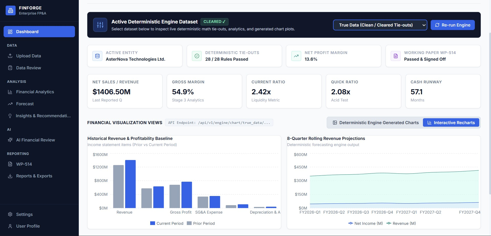
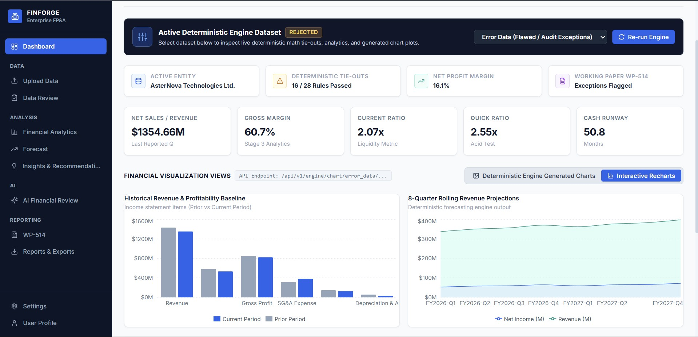

<div align="center">


# FinForge

**Enterprise financial intelligence: deterministic audit tie-outs, FP&A analytics, rolling forecasts and AI-assisted review in one platform.**


</div>

---

## Table of Contents

- [Demo Video](#-demo-video)
- [Overview](#overview)
- [Key Features](#key-features)
- [Architecture](#architecture)
- [Screenshots](#screenshots)
- [Tech Stack](#tech-stack)
- [Repository Structure](#repository-structure)
- [Getting Started](#getting-started)
- [Environment Variables](#environment-variables)
- [API Reference](#api-reference)
- [Deterministic Engine CLI](#deterministic-engine-cli)
- [Testing and Benchmarking](#testing-and-benchmarking)
- [Outputs and Deliverables](#outputs-and-deliverables)
- [Exclusions](#exclusions)
- [Security and Production Readiness](#security-and-production-readiness)
- [Roadmap](#roadmap)
- [Contributing](#contributing)
- [License](#license)

---

## 🎬 Demo Video

Click the preview below to watch the full FinForge walkthrough.

<div align="center">

[](https://drive.google.com/file/d/1G4_FlUsLREDrcvr7pKDvrxoFym9j8oof/view)

▶️ **[Watch the demo on Google Drive](https://drive.google.com/file/d/1G4_FlUsLREDrcvr7pKDvrxoFym9j8oof/view)**

</div>

> A local copy of the video is available at [`architecture/DEMO_VIDEO.mp4`](architecture/DEMO_VIDEO.mp4).

---

## Overview

FinForge ingests financial datasets, validates them with deterministic audit logic, generates FP&A analytics and forecasts, and presents the results in a React dashboard. It is built for teams that work with financial statements, planning data, lead schedules and reconciliation packs.

It turns raw uploaded files into a controlled, traceable workflow:

1. File ingestion and dataset normalization
2. Audit rule execution and exception detection
3. Financial analytics and ratio intelligence
4. Rolling 4Q/8Q forecasts and strategic recommendations
5. PDF, Excel, PNG and JSON deliverable export
6. Executive AI summary generation with Google Gemini

### Business value

| Benefit | How FinForge delivers it |
|---|---|
| Less manual validation | Automated tie-outs and guardrail checks |
| Exception transparency | Every flagged item is traceable to a rule ID |
| Faster review cycles | One workflow from upload to exported workpaper |
| Strategic insight | Ratio trends, 4Q/8Q projections and recommendations |
| Audit-ready evidence | Durable PDF, Excel and JSON artifacts |

---

## Key Features

- **Deterministic audit engine** that runs tie-out assertions and guardrail rules:
  - Income statement: revenue growth, gross margin, OpEx ratio, tax rate (`IS_GUARD_01-04`)
  - Balance sheet: cash buffer, current ratio, DSO, debt-to-equity (`BS_GUARD_01-04`)
  - Cash flow: OCF vs. net income, CapEx, dividends (`CF_GUARD_01-03`)
  - Equity: retained earnings continuity, buybacks (`EQ_GUARD_01-02`)
  - Footnotes and notes (`NOTE_GUARD_*`)
- **Line-item spell checker** that catches mislabelled financial line items at ingestion
- **FP&A analytics** covering ratios, variance analysis and historical baselines
- **Rolling forecasts** over 4 and 8 quarters, with strategic planning recommendations
- **WP-514 working paper** with schedule checks, procedure tie-outs and conclusions
- **AI Financial Review**, an executive summary generated through the Gemini API
- **Interactive dashboard** with KPI cards, charts, filters and a workflow stepper
- **One-click exports**: audit PDF, FP&A PDF, strategic PDF and WP-514 Excel workpaper
- **Synthetic data generators** with injected flaws and a ground-truth file for benchmarking

---

## Architecture

FinForge uses a three-tier design.

```text
        Upload / Ingest Data
                 |
                 v
   +-----------------------------+
   |  Frontend (React + Vite)    |   Dashboard, charts, exports
   +--------------+--------------+
                  | REST /api/v1
                  v
   +-----------------------------+        +------------------------+
   |  Backend API (FastAPI)      |------->|  Supabase              |
   |  routes -> services         |        |  files + metadata      |
   +--------------+--------------+        +------------------------+
                  |                       +------------------------+
                  +---------------------->|  Gemini API            |
                  |                       |  executive AI summary  |
                  v                       +------------------------+
   +-----------------------------+
   |  Deterministic Engine       |
   |  - Audit tie-outs           |
   |  - FP&A analytics           |
   |  - 4Q / 8Q forecasts        |
   |  - Strategic recommendations|
   |  - PDF / Excel / PNG output |
   +-----------------------------+
```

| Layer | Responsibility |
|---|---|
| **Presentation** | React + TypeScript SPA with page-based navigation, KPI cards, charts and report actions |
| **Application** | FastAPI handles uploads, orchestration, report retrieval and chart serving |
| **Intelligence** | A Python engine loads dataset folders, runs the finance logic and writes deliverables to `result/<dataset_id>/` |

### Data flow

1. The user uploads source files through the UI or the API.
2. The backend validates the files and stores them in the ingestion pipeline.
3. The engine resolves the dataset and result directories.
4. Deterministic rules calculate exceptions and variances.
5. The analytics engine computes trend metrics and ratios.
6. The forecast engine runs 4Q and 8Q projections.
7. Results are persisted locally and, optionally, in Supabase.
8. The frontend queries the backend to render dashboards and reports.
9. Users export PDFs, charts and Excel workpapers.

---

## Screenshots

| | |
|:---:|:---:|
| <br/>**Dashboard** | <br/>**Upload Data** |
| <br/>**Data Review and Exceptions** | <br/>**Financial Analytics** |
| <br/>**Forecast and Scenario Planning** | <br/>**Insights and Recommendations** |
| <br/>**AI Financial Review** | <br/>**WP-514 Working Paper** |
| <br/>**Reports and Exports** | <br/>**Deterministic Rule Inspection** |
| <br/>**Financial Charts** | <br/>**Interactive Charts** |

---

## Tech Stack

| Area | Technologies |
|---|---|
| **Frontend** | React 18, TypeScript 5.5, Vite 5, Tailwind CSS 3.4, Recharts, lucide-react, ESLint 9 |
| **Backend** | FastAPI, Uvicorn, Pydantic 2, python-multipart, python-dotenv |
| **Engine** | Python 3.10+, pandas, openpyxl, matplotlib, reportlab, pytest |
| **Data and AI** | Supabase (storage and metadata), Google Gemini REST API |
| **Formats** | Input: `.xlsx`, `.xls`, `.csv`, `.json`. Output: JSON, PDF, PNG, Excel |

---

## Repository Structure

```text
FinForge/
├── Backend/
│   ├── requirements.txt
│   └── app/
│       ├── main.py                  # FastAPI entry point
│       ├── database.py              # Supabase client
│       ├── routes/                  # engine.py, ingestion.py
│       └── services/                # ai_service, engine_service, ingestion, metadata, parser
├── Frontend/
│   ├── package.json
│   ├── vite.config.ts
│   └── src/
│       ├── pages/                   # Dashboard, Upload, Ingestion, DataReview, Analytics,
│       │                            # Forecast, Insights, AIReview, WP514, Reports
│       ├── components/              # layout/ and ui/ (KpiCard, ChartCard, FilterBar, ...)
│       ├── services/api.ts          # Backend API client
│       └── config/navigation.ts
├── deterministic_engine/
│   ├── main.py                      # CLI entry point
│   ├── evaluate_performance.py      # Benchmark against injected-flaw ground truth
│   ├── math_engine/                 # Core tie-outs, guardrails, assertions, ingestion
│   ├── analytics/                   # Ratios, historical baselines, charts
│   ├── forecasting/                 # 4Q / 8Q engine and charts
│   ├── reporters/                   # Excel and PDF reporters
│   ├── data_generator/              # Synthetic and flawed dataset generators
│   ├── schema/                      # JSON schemas and templates
│   ├── Data/                        # True_data and Error_data
│   ├── result/                      # Generated deliverables
│   └── tests/                       # pytest suite
├── architecture/                    # Screenshots and demo video
├── .gitignore
└── README.md
```

---

## Getting Started

### Prerequisites

- Node.js 18+ and npm
- Python 3.10+ and pip
- (Optional) A Supabase project and a Gemini API key for storage and AI summaries

### 1. Clone

```bash
git clone <your-repository-url>
cd FinForge
```

### 2. Backend

```bash
cd Backend
python -m venv .venv
# Windows: .venv\Scripts\activate    macOS/Linux: source .venv/bin/activate
pip install -r requirements.txt
```

Create `Backend/.env` (see [Environment Variables](#environment-variables)), then start the API:

```bash
python -m uvicorn app.main:app --host 0.0.0.0 --port 8000 --reload
```

The API is served at `http://localhost:8000`. FastAPI's interactive docs are available at `/docs`.

### 3. Frontend

```bash
cd Frontend
npm install
npm run dev
```

The app runs at `http://localhost:5173` and calls `http://localhost:8000` by default.

### 4. Deterministic engine (standalone)

```bash
cd deterministic_engine
pip install -r requirements.txt
python main.py --dataset both
```

---

## Environment Variables

**Backend** (`Backend/.env`):

| Variable | Required | Description |
|---|:---:|---|
| `PORT` | No | API port (default `8000`) |
| `SUPABASE_URL` | For storage | Supabase project URL |
| `SUPABASE_SERVICE_ROLE_KEY` | For storage | Supabase service-role key (**keep secret**) |
| `SUPABASE_STORAGE_BUCKET` | For storage | Bucket name for uploaded files |
| `GEMINI_API_KEY` | For AI summary | Google Gemini API key |

**Frontend**:

| Variable | Required | Description |
|---|:---:|---|
| `VITE_API_BASE_URL` | No | Backend base URL (default `http://localhost:8000`) |

Example `Backend/.env`:

```env
PORT=8000
SUPABASE_URL=your_supabase_project_url
SUPABASE_SERVICE_ROLE_KEY=your_service_role_key
SUPABASE_STORAGE_BUCKET=financial-files
GEMINI_API_KEY=your_gemini_api_key
```

> ⚠️ Never commit `.env` files. They are excluded through `.gitignore`.

---

## API Reference

All business routes live under `/api/v1`.

| Method | Endpoint | Description |
|---|---|---|
| `GET` | `/` | Service status |
| `GET` | `/health` | Health check |
| `POST` | `/api/v1/ingestion/upload` | Upload one file (`file`, `period_type`, `dataset_id`, `source_path`) |
| `POST` | `/api/v1/ingestion/upload-batch` | Upload multiple files (`files`, `period_type`, `dataset_id`) |
| `GET` | `/api/v1/engine/datasets` | List available datasets |
| `POST` | `/api/v1/engine/run` | Run the engine (`{"dataset_id", "remediated"}`) |
| `GET` | `/api/v1/engine/audit-report/{dataset_id}` | Audit tie-out report (JSON) |
| `GET` | `/api/v1/engine/analytics/{dataset_id}` | FP&A analytics report |
| `GET` | `/api/v1/engine/forecast/{dataset_id}` | Projections and strategic recommendations |
| `GET` | `/api/v1/engine/wp514/{dataset_id}` | WP-514 working paper data |
| `GET` | `/api/v1/engine/ai-summary/{dataset_id}` | Gemini executive summary |
| `GET` | `/api/v1/engine/download/{dataset_id}/{file_type}` | `audit_pdf`, `fpa_pdf`, `strategic_pdf`, `wp514_excel` |
| `GET` | `/api/v1/engine/chart/{dataset_id}/{chart_name}` | `ratios`, `income_statement`, `revenue_trajectory`, `cash_runway` |

`period_type` accepts `current`, `prior` or `other`.

### Examples

```bash
# Health check
curl http://localhost:8000/health

# Run the engine on the flawed dataset
curl -X POST http://localhost:8000/api/v1/engine/run \
  -H "Content-Type: application/json" \
  -d '{"dataset_id":"error_data","remediated":false}'

# Fetch the audit report
curl http://localhost:8000/api/v1/engine/audit-report/error_data

# Download the audit PDF
curl -L http://localhost:8000/api/v1/engine/download/error_data/audit_pdf -o audit_report.pdf
```

<details>
<summary>Sample <code>/engine/run</code> response</summary>

```json
{
  "success": true,
  "data": {
    "status": "success",
    "message": "Deterministic engine executed successfully for 'error_data'.",
    "dataset_id": "error_data",
    "target_dir": ".../deterministic_engine/result/error_data",
    "overall_status": "FAIL"
  }
}
```

</details>

<details>
<summary>Sample <code>/engine/datasets</code> response</summary>

```json
{
  "success": true,
  "count": 2,
  "datasets": [
    { "id": "error_data", "name": "Error Data (Flawed / Audit Exceptions)", "is_default": true },
    { "id": "true_data",  "name": "True Data (Clean / Cleared Tie-outs)",   "is_default": false }
  ]
}
```

</details>

---

## Deterministic Engine CLI

```bash
cd deterministic_engine
python main.py --dataset both --export-all
```

| Flag | Description |
|---|---|
| `--dataset {error,error_data,true,true_data,both}` | Dataset to run (default `both`) |
| `--data-dir` | Custom input data directory |
| `--result-dir` | Output directory (default `result`) |
| `--export-all` | Export all PDF, Excel and chart deliverables |
| `--remediate` | Run against the remediated version of the data |

Each run also appends to `result/audit_run_history.json`.

---

## Testing and Benchmarking

```bash
cd deterministic_engine
pytest
```

The suite in `tests/test_math_engine.py` covers schema ingestion, structured report generation, true and error dataset loading, PDF deliverables, the forecasting engine and the line-item spell checker.

**Detection benchmark.** `evaluate_performance.py` scores the engine against `Data/Error_data/injected_flaws_ground_truth.json` and reports TP/FP/TN/FN, accuracy, precision, recall, false-positive rate and F1.

```bash
python evaluate_performance.py
```

**Frontend checks:**

```bash
cd Frontend
npm run lint
npm run typecheck
```

---

## Outputs and Deliverables

Generated under `deterministic_engine/result/<dataset_id>/`:

| Artifact | Format |
|---|---|
| Audit tie-outs report | JSON, PDF |
| FP&A analytics report | JSON, PDF |
| Strategic planning recommendations | JSON, PDF |
| WP-514 audit workpaper | Excel |
| Financial charts | PNG |

---

## Exclusions

### Excluded from version control

Set in the root, `Frontend/` and `deterministic_engine/` `.gitignore` files:

| Category | Patterns |
|---|---|
| Secrets | `.env*` |
| Dependencies | `node_modules`, `.venv`, `venv`, `env` |
| Build output | `dist`, `build`, `out`, `.vite`, `*.tsbuildinfo` |
| Python artifacts | `__pycache__`, `*.py[cod]`, `*.egg-info`, pytest/mypy/ruff caches |
| Test output | `coverage`, `htmlcov` |
| Local data and logs | `*.sqlite3`, `*.db`, `*.log`, `tmp`, `temp`, `.cache` |
| Editor and OS files | `.vscode/`, `.idea`, `.DS_Store`, `Thumbs.db` |
| Archives | `*.zip`, `*.tar.gz` |

### Out of scope (current release)

- Authentication and role-based access control
- Frontend automated tests
- Docker images and CI/CD pipelines
- Real ERP or ledger connectors. The datasets are synthetic.
- Multi-tenant data separation

### Never commit

- `Backend/.env` and any Supabase service-role key or Gemini key
- Generated `result/` artifacts from private or production datasets

---

## Security and Production Readiness

- File-type validation on all upload routes
- Configuration only through environment variables
- Repeatable deterministic pipeline whose outputs are stored as auditable artifacts
- Dataset path resolution that keeps each dataset's outputs separate
- Persistent report storage through Supabase

**Before production deployment:**

- Restrict CORS. It is currently `allow_origins=["*"]`.
- Add authentication and authorization.
- Move long-running engine jobs to background workers.
- Provide a `.env.example` and a secret manager.

---

## Roadmap

- [ ] Role-based access control and secure authentication
- [ ] Multi-tenant data separation
- [ ] Asynchronous background job orchestration
- [ ] Audit trail versioning and approval states
- [ ] Human-in-the-loop AI review controls
- [ ] ERP and ledger integrations
- [ ] Scheduled export and distribution
- [ ] Dockerization and CI/CD

---

## Contributing

1. Fork the repository and create a feature branch: `git checkout -b feature/your-feature`
2. Make your changes and run `pytest` (engine) and `npm run lint && npm run typecheck` (frontend).
3. Commit with a clear message and open a pull request.

---

## License

No license file is currently included in this repository. Add a `LICENSE` file, such as MIT or Apache-2.0, before making the project publicly reusable.

---

<div align="center">

Built for the Cognizant Hackathon.

</div>
